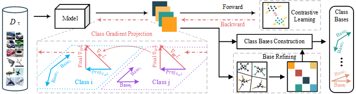

# CGP
---

**Class Gradient Projection For Continual Learning**
Cheng Chen, Ji Zhang, Jingkuan Song, LianLi Gao.
ACM MM 2022.



## Abstract
---
Catastrophic forgetting is one of the most critical challenges in Continual Learning (CL). Recent approaches tackle this problem by projecting the gradient update orthogonal to the gradient subspace of existing tasks. While the results are remarkable, those approaches ignore the fact that these calculated gradients are not guaranteed to be orthogonal to the gradient subspace of each class due to the class deviation in tasks, e.g., distinguishing “Man” from “Sea” v.s. differentiating “Boy” from “Girl”. Therefore, this strategy may still cause catastrophic forgetting for some classes. In this paper, we propose Class Gradient Projection (CGP), which calculates the gradient subspace from individual classes rather than tasks. Gradient update orthogonal to the gradient subspace of existing classes can be effectively utilized to minimize interference from other classes. To improve the generalization and efficiency, we further design a Base Refining (BR) algorithm to combine similar classes and refine class bases dynamically. Moreover, we leverage a contrastive learning method to improve the model’s ability to handle unseen tasks. Extensive experiments on benchmark datasets demonstrate the effectiveness of our proposed approach. It improves the previous methods by 2.0% on the CIFAR-100 dataset.


## Experiments
---
This repository currently contains experiments reported in the paper for 5-split CIFAR-100, 10-split CIFAR-100, 20-tasks CIFAR-100 Superclass datasets and 5-datasets. 
For CIFAR-100 dataset, experiments can be run using the following command:

```python
python main_cifar100.py
```
For various experiments, you should know the role of each argument.

- `num_task`：The number of all training task, [5,10,20].
- `simi_threshold`: The threshold to  refine class bases dynamically, [0-1].
- `seed`: Random Seed Number


## Citation
---
```
@inproceedings{DBLP:conf/mm/ChenZSG22,
  author    = {Cheng Chen and
               Ji Zhang and
               Jingkuan Song and
               Lianli Gao},
  title     = {Class Gradient Projection For Continual Learning},
  booktitle = {{MM} '22: The 30th {ACM} International Conference on Multimedia, Lisboa,
               Portugal, October 10 - 14, 2022},
  pages     = {5575--5583},
  publisher = {{ACM}},
  year      = {2022},
}
```
